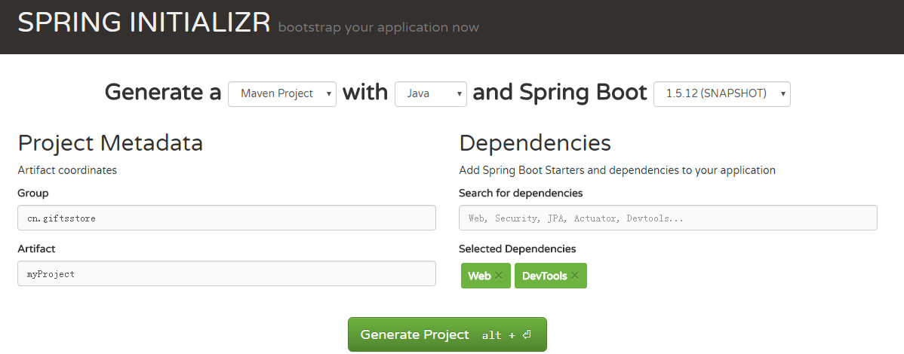
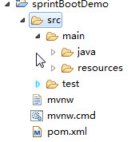

# Spring Boot技术栈(快速上手SpringBoot)
 - 本篇带大家搭建开发环境，感受SpringBoot快速开发带来的好处
# SpringBoot简介

# 了解SpringBoot

Spring Boot 是一套全新的框架，它来自于 Spring 大家族，因此 Spring 所有具备的功能它都有，而且更容易使用；Spring Boot 以约定大于配置的核心思想，默认帮我们进行了很多设置，**多数 Spring Boot 应用只需要很少的 Spring 配置**。Spring Boot 开发了很多的应用集成包，支持绝大多数开源软件，让我们以很低的成本去集成其他主流开源软件。

Spring Boot 所集成的技术栈，几乎都是各互联网公司在使用的技术，按照 Spring Boot 的路线去学习，基本可以了解国内外互联网公司的技术特点。

Spring Boot 和微服务架构都是未来软件开发的一个大趋势，越早参与其中受益越大。

# 快速构建springboot项目

1. 访问 http://start.spring.io/。
2. 选择构建工具 Maven Project、Spring Boot 版本 1.5.8 及一些工程基本信息，可参考下图：

3. 单击 Generate Project 按钮并下载项目压缩包。
4. 解压后，单击 Eclipse，Import | Existing Maven Projects | Next | 选择解压后的文件夹 | Finsh 命令，OK Done!

### 对上面的配置做一个解释：

- 第一个选择框选择创建以 Maven 构建项目，还是以 Gradle 构建项目，这是两种不同的构建方式，其中 Gradel 配置内容更简洁一些，并且包含了 Maven 的使用，不过日常使用 Maven 居多。
- 第二个选择框选择编程语言，现在支持 Java、Kotlin 和 Groovy。
- 第三个选择框选择 Spring Boot 版本，可以看出 Spring Boot 2.0 已经到了第五个里程碑了。在实际使用中，我们会优先使用稳定版本，1.0 的最新稳定版本是 1.5.8，也是我们演示使用的版本。

### 下面就是项目的配置信息了。

- Group：一般填写公司域名，比如传智播客填 cn.itcast
- Artifact：可以理解为项目的名称，可以根据实际情况来填，本次演示填写 springBootDemo。
- Dependencies：在这块添加我们项目所依赖的 Spring Boot 组件，可以多选。本次选择 Web、devtools 两个模块。

### 项目结构介绍

Spring Boot 的基础结构共三个文件：


- src/main/java：程序开发以及主程序入口
- src/main/resources：配置文件
- src/test/java：测试程序

### Sping Boot 建议的目录结果如下：

root package 结构：com.example.myproject

	myproject
	 +-src
	    +- main
	         +- java
	              +- com.example.myproject
	                    +- comm
	                    +- domain
	                    +- repository
	                    +- service
	                    +- web
	                    +- Application.java
	         +- resources
	              +- static
	              +- templates
	              +- application.properties
	    +- test
	 +-pom.xml

### com.example.myproject 目录下：

- Application.java：建议放到根目录下面，是项目的启动类，Spring Boot 项目只能有一个 main() 方法。
- comm：目录建议放置公共的类，如全局的配置文件、工具类等。
- domain：目录主要用于实体（Entity）与数据访问层（Repository）。
- repository：数据库访问层代码。
- service：该层主要是业务类代码。
- web：该层负责页面访问控制。
- resources 目录下：

	- static：目录存放 Web 访问的静态资源，如 JS、CSS、图片等。
	- templates：目录存放页面模板。
	- application.properties：项目的配置信息。
	- test 目录存放单元测试的代码；pom.xml 用于配置项目依赖包，以及其他配置。

采用默认配置可以省去很多设置，当然也可以根据自己的喜好来进行更改。最后，启动 Application main 方法，至此一个 Java 项目搭建好了！

# 简单 Web 开发
1. 可以在 Spring Initializr 上面添加，也可以手动在 pom.xml 中添加：
	<pre>
	<dependency>
		<groupId>org.springframework.boot</groupId>
		<artifactId>spring-boot-starter-web</artifactId>
	</dependency>
	</pre>

	pom.xml 文件中默认有两个模块：
	
	spring-boot-starter：核心模块，包括自动配置支持、日志和 YAML；
	
	spring-boot-starter-test：测试模块，包括 JUnit、Hamcrest、Mockito。
2. 编写 controller 内容：

	<pre>
	@RestController
	public class HelloWorldController {
	    @RequestMapping("/hello")
	    public String hello() {
	        return "Hello World";
	    }
	}
	</pre>
	@RestController 的意思就是 controller 里面的方法都以 json 格式输出，不用再配置什么 jackjson 的了！
	
	如果配置为@Controller 就代表着输出为页面内容。

3. 启动主程序，打开浏览器访问 http://localhost:8080/hello，就可以看到以下内容，是不是很简单！
	<pre>
	Hello World
	</pre>
4.如果我们想传入参数怎么办？
	<pre>
	@RestController
	public class HelloWorldController {
	
	    @RequestMapping("/hello")
	    public String index(String name) {
	        return "Hello World, " +name;
	    }
	}
	</pre>

	重新启动项目，访问 http://localhost:8080/hello?name=neo，返回内容如下：

	<pre>
	Hello World，neo
	</pre>

	经过上一个测试发现，修改 controller 内相关代码，就需要重新启动项目才能生效，这样做很麻烦是不是，别着急。Spring Boot 提供了另外一个组件来解决。

### 热部署

热启动就需要用到我们在一开始引入的另外一个组件：devtools。它是 Spring Boot 提供的一组开发工具包，其中就包含我们需要的热部署功能。但是在使用这个功能之前还需要再做一些配置。

1. 在 dependency 中添加 optional 属性，并设置为 true：
		```
		<dependencies>
		    <dependency>
		        <groupId>org.springframework.boot</groupId>
		        <artifactId>spring-boot-Devtools</artifactId>
		        <optional>true</optional>
		    </dependency>
		</dependencies>
		```
2. 在 plugin 中配置另外一个属性 fork，并且配置为 true：
	```
	<build>
	    <plugins>
	        <plugin>
	            <groupId>org.springframework.boot</groupId>
	            <artifactId>spring-boot-maven-plugin</artifactId>
	            <configuration>
	                <fork>true</fork>
	            </configuration>
	        </plugin>
		</plugins>
	</build>
	```