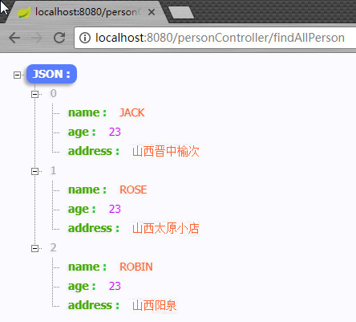
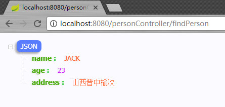
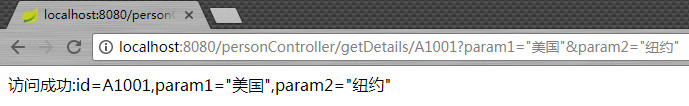
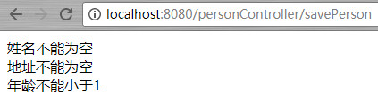

# Spring Boot技术栈(快速上手SpringBoot)

 - 本篇介绍 Spring Boot中spring-boot-starter-web 对 Web 开发的支持，主要包括 RESTful、参数校验、过滤器等功能。

# 1.编写RestFul风格的代码

 在 Spring Boot 体系中，天然对 Json 支持。无论返回集合还是对象，Spring Boot 均可以将其转化为 Json 字符串，特别适合我们给其他系统提供接口时使用。
 
 1. 在domain包下新建一个实体类 Person，Person 信息如下：
	<pre>

	public class Person {
	    private String name;//姓名
	    private int age;//年龄
	    private String address;//住址
	    //省略无参、全参构造/getter、setter方法
	}

	</pre> 

 2. 在web包下新建一个类 PersonController ,PersonController 信息如下
 	<pre>
	@RestController
	@RequestMapping("personController")
	public class PersonController {
	    /**
	     * 演示返回一个集合对象的JSON数据，访问方式 http://localhost:8080/personController/findAllPerson
	     * @return
	     */
	    @RequestMapping("findAllPerson")
	    public ArrayList<Person> findAllPerson(){
	        ArrayList<Person> persons = new ArrayList<>();
	
	        persons.add(new Person("JACK",23,"山西晋中榆次"));
	        persons.add(new Person("ROSE",23,"山西太原小店"));
	        persons.add(new Person("ROBIN",23,"山西阳泉"));
	
	        return persons;
	    }
	
	    /**
	     * 演示返回一个实体类对象的JSON数据。访问方式 http://localhost:8080/personController/findPerson
	     * @return
	     */
	    @RequestMapping("findPerson")
	    public Person findPerson(){
	        return new Person("JACK",23,"山西晋中榆次");
	    }
	}

	</pre>
 3. 访问 http://localhost:8080/personController/findAllPerson 返回结果如下
 
 	
 4. 访问 http://localhost:8080/personController/findPerson 返回结果如下
 
 	
	
	**注：** 浏览器中的返回结果看起来非常美观是因为使用了Google浏览器插件JSON-handle，安装方法参见[https://jingyan.baidu.com/article/c910274bb4b659cd361d2dad.html](https://jingyan.baidu.com/article/c910274bb4b659cd361d2dad.html "点此查看JSON-handle的安装方法")

# 2.POST和GET传参&参数校验

## 1.POST 传参
 1. 通过 @RequestMapping 注解的 method 属性指定请求方式为POST
 2. 给方法添加形式参数用于接收客户端请求发送过来的数据
	<pre>
 	/**
     * 如果形式参数是Person类型，只要是 Person 的属性都会被自动填充到 person 对象中
     * 访问路径http://localhost:8080/personController/showPersonInfo1
     * @param person
     * @return
     */
    @RequestMapping(value = "showPersonInfo1", method = RequestMethod.POST)
    public Person showPersonInfo(Person person){
        return person;
    }

    /**
     * 接收name，age，address参数并手动将其封装成Person对象
     * 访问路径http://localhost:8080/personController/showPersonInfo2
     * @param person
     * @return
     */
    @RequestMapping(value = "showPersonInfo2", method = RequestMethod.POST)
    public Person showPersonInfo(String name, int age, String address){
        Person p = new Person(name,age,address);
        return p;
    }
	</pre>

	**注：** 在使用第一种方式接受数据的时候**Person类必须有一个无参构造**，框架内部先通过无参构造创建对象，然后调用set方法赋值，最后将对象当作 *实际参数* 赋值给 *形式参数*

## 2.GET 传参
 1. @RequestMapping 注解的method属性默认就是GET请求，当然也可以手动指定
 2. 使用 @RequestParam 或者 @PathVariable 来接收参数
	<pre>
	/**
     * 访问路径http://localhost:8080/personController/getDetails/A1001?param1="美国"&param2="纽约"
     * @param id
     * @param param1
     * @param param2
     * @return
     */
    @RequestMapping("/getDetails/{id}")
    public String getDetails(@PathVariable(value="id") String id,
                             @RequestParam(value="param1", required=true) String param1,
                             @RequestParam(value="param2", required=false) String param2){

        return "访问成功:id="+id+",param1="+param1+",param2="+param2;
    }
	</pre>

	结果如下

	
 - **@RequestParam**和**@PathVariable**注解的作用

	- @RequestParam 和 @PathVariable 注解是用于从request中接收请求的，两个都可以接收参数.@RequestParam是从请求中获取数据，也就是获取URL中?后面的后面获取数据。而@PathVariable则是获取URL地址中的一部分值。
	
	- **@RequestParam** 支持下面四种参数

		1. defaultValue 如果本次请求没有携带这个参数，或者参数为空，那么就会启用默认值
		2. name 绑定本次参数的名称，要跟URL上面的一样
		3. required 这个参数是不是必须的
		4. value 跟name一样的作用，是name属性的一个别名 
	
	- **建议：**作为一种最佳实践，几乎所有开发人员都在按照以下方式推荐。如果你想识别资源，你应该使用路径变量。但是如果你想排序或过滤项目，那么你应该使用查询参数。	

## 3.参数校验

 参数校验在我们日常开发中非常常见，最基本的校验有判断属性是否为空、长度是否符合要求等，在传统的开发模式中需要写一堆的 if else 来处理这些逻辑，很繁琐，效率也低。使用 @Valid + BindingResult 就可以优雅地解决这些问题，接下来看看示例：

 1. 首先在 PersonController 添加一个保存用户的方法 savePerson，参数为 Person，现在需要对参数 Person  做校验：
	<pre>
	public class Person {
	    @NotEmpty(message="姓名不能为空")
	    private String name;
	    @Max(value = 100,message = "年龄不能大于100")
	    @Min(value = 1,message = "年龄不能小于1")
	    private int age;
	    @Length(message = "地址长度应该在7-10个汉字之间",min = 14,max=20)
	    @NotEmpty(message = "地址不能为空")
	    private String address;
	    //省略无参、全参构造/getter、setter方法
	}
	</pre>
 2. Spring Boot 的参数校验其实是依赖于 hibernate-validator 来进行。现在模拟对参数 User 进行参数校验，使用 @Valid + BindingResult，校验后如果有错误将错误打印出来，代码如下：
 	<pre>
	@RequestMapping("savePerson")
    public String savePerson(@Valid Person person, BindingResult result){
        String message = "";
        if(result.hasErrors()){
            List<ObjectError> allErrors = result.getAllErrors();
            for (ObjectError error : allErrors) {
                message += error.getDefaultMessage()+"< br/ >";
            }
        }

        if(message==""){
            message = "添加成功";
        }
        return message;
    }
	</pre>
 3. 访问http://localhost:8080/personController/savePerson，结果如下

	

 4. **附：**java校验api所提供的校验注解
	- @AssertFalse 所注解的元素必须为 boolean类型,并且值为 false
	- @AssertTrue 所注解的元素必须为 boolean类型,并且值为 true
	- Digits 所注解的元素必须是数字,并且它的值必须有指定的位数
	- Future 所注解的值必须是一个将来的日期
	- Past 所注解的值必须是一个已经过去的日期
	- Min 所注解的元素必须是数字,并且它的值必须小于等度给定的值
	- Max 所注解的元素必须是数字,并且它的值必须大于等度给定的值
	- NotNull 所注解的元素不能为null
	- NotEmpty 所注解元素不能为 空(注意不是null)
	- Null 做注解的元素必须为null
	- Size 所注解的元素必须是String,集合,或数组,并且它的长度要符合给定的范围
	- Pattern 所注解的元素的值必须匹配给定的正则表达式
	
