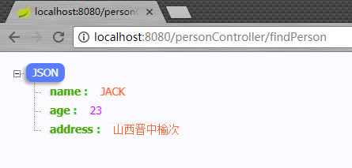
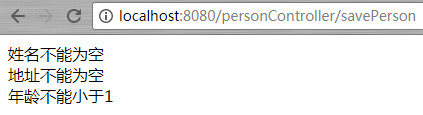

# Spring Boot技术栈(Spring Boot 对 Web 开发的支持)

 - 本篇介绍 Spring Boot中spring-boot-starter-web 对 Web 开发的支持，主要包括 RestFul、获取请求参数、过滤器等功能。

# 1.编写RestFul风格的代码

 在 Spring Boot 体系中，天然对 Json 支持。无论返回集合还是对象，Spring Boot 均可以将其转化为 Json 字符串，特别适合我们给其他系统提供接口时使用。
 
 1. 在domain包下新建一个实体类 Person，Person 信息如下：
	<pre>

	public class Person {
	    private String name;//姓名
	    private int age;//年龄
	    private String address;//住址
	    //省略无参、全参构造/getter、setter方法
	}

	</pre> 

 2. 在web包下新建一个类 PersonController ,PersonController 信息如下
 	
    <pre>
	@RestController
	@RequestMapping("personController")
	public class PersonController {
	    /**
	     * 演示返回一个集合对象的JSON数据，访问方式 http://localhost:8080/personController/findAllPerson
	     * @return
	     */
	    @RequestMapping("findAllPerson")
	    public ArrayList<Person> findAllPerson(){
	        ArrayList<Person> persons = new ArrayList<>();
	
	        persons.add(new Person("JACK",23,"山西晋中榆次"));
	        persons.add(new Person("ROSE",23,"山西太原小店"));
	        persons.add(new Person("ROBIN",23,"山西阳泉"));
	
	        return persons;
	    }
	
	    /**
	     * 演示返回一个实体类对象的JSON数据。访问方式 http://localhost:8080/personController/findPerson
	     * @return
	     */
	    @RequestMapping("findPerson")
	    public Person findPerson(){
	        return new Person("JACK",23,"山西晋中榆次");
	    }
	}

	</pre>
 3. 访问 http://localhost:8080/personController/findAllPerson 返回结果如下
 
 	
 4. 访问 http://localhost:8080/personController/findPerson 返回结果如下
 
 	
	
	**注：** 浏览器中的返回结果看起来非常美观是因为使用了Google浏览器插件JSON-handle，安装方法参见[https://jingyan.baidu.com/article/c910274bb4b659cd361d2dad.html](https://jingyan.baidu.com/article/c910274bb4b659cd361d2dad.html "点此查看JSON-handle的安装方法")

# 2.POST和GET传参&参数校验

## 1.POST 传参
 1. 通过 @RequestMapping 注解的 method 属性指定请求方式为POST
 2. 给方法添加形式参数用于接收客户端请求发送过来的数据
	<pre>
 	/**
     * 如果形式参数是Person类型，只要是 Person 的属性都会被自动填充到 person 对象中
     * 访问路径http://localhost:8080/personController/showPersonInfo1
     * @
     * 
     *  person
     * @return
     */
    @RequestMapping(value = "showPersonInfo1", method = RequestMethod.POST)
    public Person showPersonInfo(Person person){
        return person;
    }

    /**
     * 接收name，age，address参数并手动将其封装成Person对象
     * 访问路径http://localhost:8080/personController/showPersonInfo2
     * @
     * m person
     * @return
     */
    @RequestMapping(value = "showPersonInfo2", method = RequestMethod.POST)
    public Person showPersonInfo(String name, int age, String address){
        Person p = new Person(name,age,address);
        return p;
    }
	</pre>

	**注：** 在使用第一种方式接受数据的时候**Person类必须有一个无参构造**，框架内部先通过无参构造创建对象，然后调用set方法赋值，最后将对象当作 *实际参数* 赋值给 *形式参数*

## 2.GET 传参
 1. @RequestMapping 注解的method属性默认就是GET请求，当然也可以手动指定
 2. 使用 @RequestParam 或者 @PathVariable 来接收参数
	<pre>
	/**
     * 访问路径http://localhost:8080/personController/getDetails/A1001?param1="美国"&param2="纽约"
     * @param id
     * @param param1
     * @param param2
     * @return
     */
    @RequestMapping("/getDetails/{id}")
    public String getDetails(@PathVariable(value="id") String id,
                             @RequestParam(value="param1", required=true) String param1,
                             @RequestParam(value="param2", required=false) String param2){

        return "访问成功:id="+id+",param1="+param1+",param2="+param2;
    }
	</pre>

	结果如下

	
 - **@RequestParam**和**@PathVariable**注解的作用

	- @RequestParam 和 @PathVariable 两个都可以接收参数.@RequestParam是从请求中获取数据，也就是获取URL中?后面的数据。而@PathVariable则是获取URL地址中的一部分值。
	
	- **@RequestParam** 支持下面四种参数

		1. defaultValue 如果本次请求没有携带这个参数，或者参数为空，那么就会启用默认值
		2. name 绑定本次参数的名称，要跟URL上面的一样
		3. required 这个参数是不是必须的
		4. value 跟name一样的作用，是name属性的一个别名 
	
	- **建议：**作为一种最佳实践，几乎所有开发人员都在按照以下方式推荐。如果你想识别资源，你应该使用路径变量。但是如果你想排序或过滤项目，那么你应该使用查询参数。	

## 3.参数校验

 参数校验在我们日常开发中非常常见，最基本的校验有判断属性是否为空、长度是否符合要求等，在传统的开发模式中需要写一堆的 if else 来处理这些逻辑，很繁琐，效率也低。使用 @Valid + BindingResult 就可以优雅地解决这些问题，接下来看看示例：

 1. 首先在 PersonController 添加一个保存用户的方法 savePerson，参数为 Person，现在需要对参数 Person  做校验：
	<pre>
	public class Person {
	    @NotEmpty(message="姓名不能为空")
	    private String name;
	    @Max(value = 100,message = "年龄不能大于100")
	    @Min(value = 1,message = "年龄不能小于1")
	    private int age;
	    @Length(message = "地址长度应该在7-10个汉字之间",min = 14,max=20)
	    @NotEmpty(message = "地址不能为空")
	    private String address;
	    //省略无参、全参构造/getter、setter方法
	}
	</pre>
 2. Spring Boot 的参数校验其实是依赖于 hibernate-validator 来进行。现在模拟对参数 User 进行参数校验，使用 @Valid + BindingResult，校验后如果有错误将错误打印出来，代码如下：
    <pre>
	@RequestMapping("savePerson")
    public String savePerson(@Valid Person person, BindingResult result){
        String message = "";
        if(result.hasErrors()){
            List<ObjectError> allErrors = result.getAllErrors();
            for (ObjectError error : allErrors) {
                message += error.getDefaultMessage();
            }
        }

        if(message==""){
            message = "添加成功";
        }
        return message;
    }
	</pre>
 3. 访问http://localhost:8080/personController/savePerson，结果如下

	

 4. **附：**java校验api所提供的校验注解
	- @AssertFalse 所注解的元素必须为 boolean类型,并且值为 false
	- @AssertTrue 所注解的元素必须为 boolean类型,并且值为 true
	- Digits 所注解的元素必须是数字,并且它的值必须有指定的位数
	- Future 所注解的值必须是一个将来的日期
	- Past 所注解的值必须是一个已经过去的日期
	- Min 所注解的元素必须是数字,并且它的值必须小于等度给定的值
	- Max 所注解的元素必须是数字,并且它的值必须大于等度给定的值
	- NotNull 所注解的元素不能为null
	- NotEmpty 所注解元素不能为 空(注意不是null)
	- Null 做注解的元素必须为null
	- Size 所注解的元素必须是String,集合,或数组,并且它的长度要符合给定的范围
	- Pattern 所注解的元素的值必须匹配给定的正则表达式
	
# 3.自定义过滤器

## 1. 过滤器功能
 过滤器可以用于记录请求日志、排除有 XSS 威胁的字符、执行权限验证等等

## 2. 自定义过滤器步骤
 1. 创建一个类实现 javax.servlet.Filter 接口
 2. 将创建的类挂载到过滤器链上
 			
 	a. 创建MyFilter类实现Filter接口
    <pre>
	public class MyFilter implements Filter {
	    @Override
	    public void init(FilterConfig filterConfig) throws ServletException {
	
	    }
	
	    @Override
	    public void doFilter(ServletRequest request, ServletResponse response, FilterChain filterChain) throws IOException, ServletException {
	        HttpServletRequest req = (HttpServletRequest) request;
	        //打印请求Url
	        System.out.println("当前客户端正在请求访问的路径是:" + req.getRequestURI());
	        filterChain.doFilter(request, response);
	    }
	
	    @Override
	    public void destroy() {
	
	    }
	}
    </pre>
 	b. 通过@Configuration + @Bean 注解将过滤器注入到 IOC 容器中，并通过 setOrder 方法设置过滤器位置（过滤器链中的位置）
    <pre>
	@Configuration
	public class MyFilterConfiguration {
	    @Bean
	    public FilterRegistrationBean myFilterRegistration() {
	        FilterRegistrationBean registration = new FilterRegistrationBean();
	        registration.setFilter(new MyFilter());//添加过滤器
	        registration.addUrlPatterns("/*");//设置过滤路径，/*所有路径
	        registration.addInitParameter("name", "alue");//添加默认参数
	        registration.setName("MyFilter");//设置优先级
	        registration.setOrder(1);//设置优先级
	        return registration;
	    }
	
	}
    </pre>

	c. 重新启动项目,访问任意一个服务，会发现在控制台中都会打印
	<pre>当前客户端正在请求访问的路径是:....</pre>
## 3. **@Configuration和@Bean注解说明:**
 1. @Configuration 标注在类上，相当于把该类作为spring的xml配置文件中的 &lt;beans&gt;，作用为：配置spring容器(应用上下文),上文中在MyFilterConfiguration类上添加了该注解，相当于创建了一个beans.xml配置文件里面的内容是
 
    ```XML

		<beans xmlns="http://www.springframework.org/schema/beans" xmlns:xsi="http://www.w3.org/2001/XMLSchema-instance"
			xmlns:context="http://www.springframework.org/schema/context" xmlns:jdbc="http://www.springframework.org/schema/jdbc"  
			xmlns:jee="http://www.springframework.org/schema/jee" xmlns:tx="http://www.springframework.org/schema/tx"
			xmlns:util="http://www.springframework.org/schema/util" xmlns:task="http://www.springframework.org/schema/task" xsi:schemaLocation="http://www.springframework.org/schema/beans http://www.springframework.org/schema/beans/spring-beans-4.0.xsd 
			http://www.springframework.org/schema/context http://www.springframework.org/schema/context/spring-context-4.0.xsd
			http://www.springframework.org/schema/jdbc http://www.springframework.org/schema/jdbc/spring-jdbc-4.0.xsd
			http://www.springframework.org/schema/jee http://www.springframework.org/schema/jee/spring-jee-4.0.xsd
			http://www.springframework.org/schema/tx http://www.springframework.org/schema/tx/spring-tx-4.0.xsd
			http://www.springframework.org/schema/util http://www.springframework.org/schema/util/spring-util-4.0.xsd
			http://www.springframework.org/schema/task http://www.springframework.org/schema/task/spring-task-4.0.xsd" default-lazy-init="false" >
		
		
		</beans>

    ```

 2. @Bean标注在方法上(返回某个实例的方法)，等价于spring的xml配置文件中的&lt;bean&gt;，作用为：注册bean对象。
  - @Bean注解在返回实例的方法上，如果未通过@Bean指定bean的名称，则默认与标注的方法名相同。
  - @Bean注解默认作用域为单例singleton作用域，可通过@Scope(“prototype”)设置为原型作用域
  
 	上文中在myFilterRegistration()方法上加了@Bean注解，表示在spring启动的时候会执行该方法并将结果作为一个bean注册到容器中，该bean的名字是"myFilterRegistration"

# 4.属性配置和自定义属性配置

  如果需要修改自定义修改默认配置，spring boot 提供了很简便的方法，只需要在application.properties 中添加修改相应的配置。（spring boot启动的时候会读取application.properties这份默认配置）

## 1.属性配置
  例如 : spring boot 开发web应用的时候，默认tomcat的启动端口为8080，如果需要修改默认的端口，则需要在application.properties 添加以下记录：
    <pre>server.port=8888</pre>
  重启项目，启动日志可以看到：Tomcat started on port(s): 8888 (http) 启动端口为8888，浏览器中访问 http://localhost:8888 能正常访问。

## 2.自定义属性配置
  在application.properties中除了可以修改默认配置，我们还可以在这配置自定义的属性，并在实体bean中加载出来。
  
  1. 在application.properties中添加自定义属性配置
    <pre>
	cn.itcast.username = LuRenJia
	cn.itcast.password = admin
    </pre>
  2. 编写Bean类，加载属性
  
    <pre>
	@Component
	@ConfigurationProperties(prefix = "cn.itcast")
	public class User {
	    private String username;
	    private String password;
	
	    //省略getter/setter方法
	}
	</pre>

	这里引入ConfigurationProperties注解的时候会报错，需要添加依赖
	
	```
	<dependency>
		<groupId>org.springframework.boot</groupId>
		<artifactId>spring-boot-configuration-processor</artifactId>
		<optional>true</optional>
	</dependency>
	```
  3. 编写控制器看看是否将数据成功加载到User中
    <pre>
	@RestController
	@RequestMapping("userController")
	public class UserController {
	    @Autowired
	    private User user;
	
	    @RequestMapping(value = "info",method = RequestMethod.GET)
	    public String info(){
	        return user.getUsername()+","+user.getPassword();
	    }
	}
	</pre>
  4. 访问http://localhost:8080/userController/info 查看结果，在页面显示如下内容
    <pre>LuRenJia,admin</pre>

	如果测试中出现中文乱码，可安装以下方法进行设置：

	依次单击 File | Settings | Editor | File Encodings 命令，将 Properties Files (*.properties) 下的 Default encoding for properties files 设置为 UTF-8，将 Transparent native-to-ascii conversion 前的复选框勾选上。