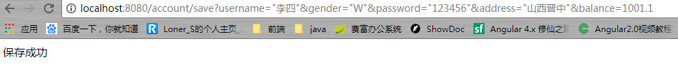
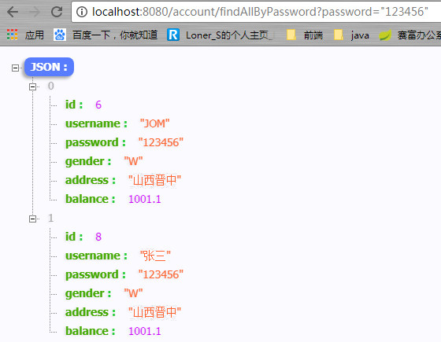

# Spring Boot技术栈(Spring Boot 对 Web 开发的支持)

 - 本篇介绍 Spring Boot 对 JPA 开发的支持

# 1.JPA介绍

 - Spring Data JPA 是 Spring 基于 ORM 框架、JPA 规范的基础上封装的一套 JPA 应用框架，可使开发者用极简的代码即可实现对数据的访问和操作。它提供了包括增删改查等在内的常用功能，且易于扩展！学习并使用 Spring Data JPA 可以极大提高开发效率！
 - Spring Data JPA 让我们解脱了 DAO 层的操作，基本上所有 CRUD 都可以依赖于它来实现。

# 2.开发环境搭建

## 1.添加依赖
```

	<dependency>
		<groupId>org.Springframework.boot</groupId>
	    <artifactId>Spring-boot-starter-data-jpa</artifactId>
	</dependency>
	 <dependency>
	    <groupId>mysql</groupId>
	    <artifactId>mysql-connector-java</artifactId>
	</dependency>

```    
## 2.修改application.properties配置文件

### 添加配置
<pre>
spring.datasource.url=jdbc:mysql://127.0.0.1:3306/heima
spring.datasource.username=root
spring.datasource.password=root
spring.datasource.driver-class-name=com.mysql.jdbc.Driver

spring.jpa.properties.hibernate.hbm2ddl.auto=update
spring.jpa.properties.hibernate.dialect=org.hibernate.dialect.MySQL5InnoDBDialect
spring.jpa.show-sql= true
</pre>

### 配置文件说明

1. spring.datasource.url : 数据库连接URL
2. spring.datasource.username : 数据库帐号
3. spring.datasource.password : 数据库密码
4. pring.datasource.driver-class-name : 驱动名
	- mysql的驱动：com.mysql.jdbc.Driver
	- oracle的驱动：oracle.jdbc.OracleDriver
	- sqlserver的驱动：com.microsoft.sqlserver.jdbc.SQLServerDriver
5. spring.jpa.properties.hibernate.hbm2ddl.auto : 自动创建 | 更新 | 验证数据库表结构
	- create : 每次加载hibernate，如果数据库中存在表，将所有表删除，然后重新生成表
	- update : 每次hibernate 时根据 model 类自动更新表结构，如果是第一次则创建表结构。之前表数据不会删除
	- validate : 设置为validate:加载hibernate时，验证创建数据库表结构，这样 spring在加载之初，如果model层和数据库表结构不同，就会报错，这样有助于技术运维预先发现问题。例如：ProductInfoEntity这个实体有property1这个属性，而对应的数据库表product没有property1这个字段，就会在tomcat启动的时候报错：错误可能如下：Missing column: property1 in wjs.product
	- create-drop : 如果一开始数据库没有表，启动tomcat的时候会生成表，当把tomcat关闭之后生成的表又会消除
6. spring.jpa.properties.hibernate.dialect ： 告诉Hibernate，将HQL翻译成哪种数据库的SQL,常见的有
	- mysql : org.hibernate.dialect.MySQLDialect
	- oracle : org.hibernate.dialect.OracleDialect
	- sqlserver : org.hibernate.dialect.SQLServerDialect
7. show-sql ： 是否在控制台打印SQL语句，建议调试时启用，方便调试。
 
## 3.创建实体类

 - 注意：
	 - 实体类在命名时候不要用数据库中的关键字比如Order,可以定义成Orders
	 - Entity 中不映射成列的字段得加 @Transient 注解，不加注解也会映射成列
	 
<pre>
/**
 * 账户
 */
@Entity
public class Account implements Serializable{
    @Id
    @GeneratedValue
    private Long id;//ID主键
    @Column(nullable = false,unique = true)
    private String username;//用户名,不能为空，不能重复
    @Column(nullable = false)
    private String password;//密码，不能为空
    @Column(nullable = false)
    private String gender;    //性别，不能为空
    @Column()
    private String address; //地址
    @Column()
    private double balance;//账户余额

    public Account(String username, String password, String gender, String address, double balance) {
        this.username = username;
        this.password = password;
        this.gender = gender;
        this.address = address;
        this.balance = balance;
    }

    //省略无参构造,getter,setter方法
}

</pre>

## 4.创建DAO

 Dao 只要继承 JpaRepository 类就可以，几乎可以不用写方法，还有一个特别有个性的功能非常赞，就是可以根据方法名来自动的生产 SQL，如 findByUserName 会自动生产一个以 userName 为参数的查询方法，如 findAll 自动会查询表里面的所有数据，如自动分页等等

<pre>
public interface AccountRepository extends JpaRepository<Account,String> {
    Account findAccountByUsername(String username);
    Account findAccountByUsernameAndAddress(String username, String address);
}
</pre>

 - 说明：JpaRepository<T,ID>这个接口只是一个空的接口，目的是为了统一所有Repository的类型，其接口类型使用了泛型，泛型参数中T代表实体类型，ID则是实体中id的类型

## 5.编写控制器测试

<pre>
@RestController
@RequestMapping("account")
public class AccountController {
    @Autowired
    AccountRepository accountRepository;

    @RequestMapping("save")
    public String save(@RequestParam String username,
                       @RequestParam String password,
                       @RequestParam String gender,
                       @RequestParam String address,
                       @RequestParam double balance) {
        Account account = new Account(username, password, gender, address, balance);
        String message = "";
        try {
            Account save = accountRepository.save(account);
            if(save!=null){
                message = "保存成功";
            }
        } catch (Exception e) {
            message = "保存失败"+e.getMessage();
            e.printStackTrace();
        }

        return message;
    }

    @RequestMapping("findAllByPassword")
    public List<Account> findAllByPassword(@RequestParam String password){
        List<Account> accounts = accountRepository.findAllByPassword(password);
        return accounts;
    }
}
</pre>

- 访问地址：
 - 保存接口
	 http://localhost:8080/account/save?username="张三"&gender="W"&password="123456"&address="山西晋中"&balance=1001.1
	 
 		- 注意：该地址访问多次的时候username要更改，因为username是唯一的
 - 查询接口
     http://localhost:8080/account/findAllByPassword?password=123456
     